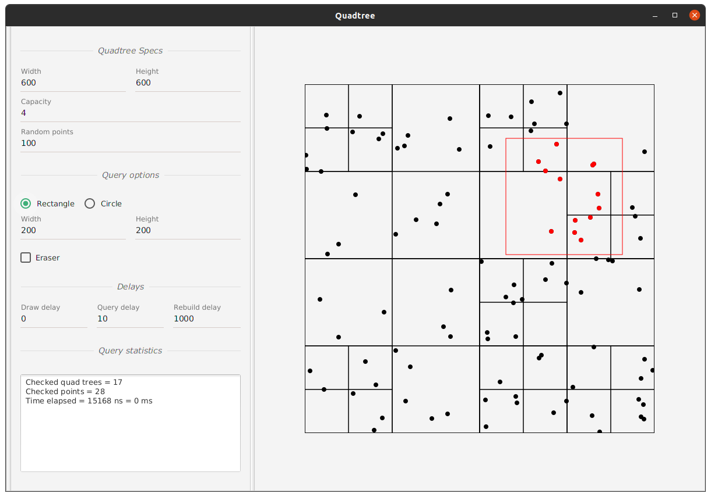

# Point Quadtree visualizer

An application which offers a **Point Quadtree** implementation within a flexible **visualizer**.

You can learn more about the Quadtrees at [Wikipedia](https://en.wikipedia.org/wiki/Quadtree).

> This application was made for an assessment during a **data structures and algorithms** college course.

Have a look,



## Ingredients

Built on top of [Java virtual machine](https://en.wikipedia.org/wiki/Java_virtual_machine) with help of the following awesome tools,

- [JavaFX](https://openjfx.io/)

	> The desktop application platform.

- [Kotlin](https://kotlinlang.org/)

	> To eliminate the boilerplate codes.

- [RxJava](https://github.com/ReactiveX/RxJava)

	> To handle user input events.

- [Gradle](https://gradle.org/)

	> The build automation tool, handles the compilation and dependencies.

- :heart:

## Getting started

To get a local copy **up and running** follow these simple steps,

1. Make sure **Java 11** or higher is installed.

	> Word *Java* is used as a substitution for *JVM*; Java virtual machine.

2. Clone the repository.

  > You can do this either by using the `git` command,
  >
  > ```sh
  > git clone https://github.com/agcom/quad-tree.git
  > ```
  >
  > or downloading and extracting the [project's `zip` artifact](https://github.com/agcom/quad-tree/archive/master.zip).

3. Run the application.

  > You need to invoke the gradle `run` task to get the application running.
  >
  > You can use the pre-made **gradle scripts** even if you don't have the required gradle bundle installed.
  >
  > - On Linux,
  >
  > 	```sh
  > 	./gradlew run
  > 	```
  >
  > - On Windows,
  >
  > 	```powershell
  > 	./gradlew.bat run
  > 	```
  >
  > 	For more information on running batch files on Windows visit this [tutorial](https://www.wikihow.com/Run-a-Batch-File-from-the-Command-Line-on-Windows).

## Usage

Let's review the application's interesting features,

- Cursor interactions

	> Click and drag on the quadtree, eventually finding yourself drawing a home!

- Change the quadtree specifications,

	> You can change the tree dimensions, *width* and *height*.
	>
	> Also, adjust the *capacity*; The amount of points each tree will hold before dividing.

- Spray *random points*

	> Your tree feeling lonely? Give him some babies for god's sake!
	>
	> Either drag your cursor on top of the tree, or let us add some *random points*.

- Change query area

	> The quadtree implementation uses abstractions for areas. Currently, two shapes are implemented, *circle* and *rectangle*.

- Erase!

	> This may seem strange, but trust me, it's a cool feature!
	>
	> Check the *eraser* box and click/drag the cursor on top of some points. This is where the magic happens! Division undo!

- Adjust the input processing delays

	> Being eager isn't always the best option.
	>
	> Delays are necessary to guarantee a lag free experience!
	>
	> If you're feeling **lags**, try increasing the delays, especially the *draw delay*.

- Some cool statistics about your query efficiency!

## Contributing

Contributions are what make the open source community such an amazing place to be learn, inspire and create.

Any contributions you make are **greatly appreciated**.

### Bug? Feature?

Create an **issue**, we'll investigate it ASAP.

If you've gone far, share your code with us. **Pull requests** are appreciated.

> Unfamiliar with pull requests? Checkout this [tutorial](https://guides.github.com/activities/forking/).

## Contact us

Got questions? Two ways, just for you.

- Create an issue with the  label.
- Directly contact the [project owner](https://github.com/agcom).